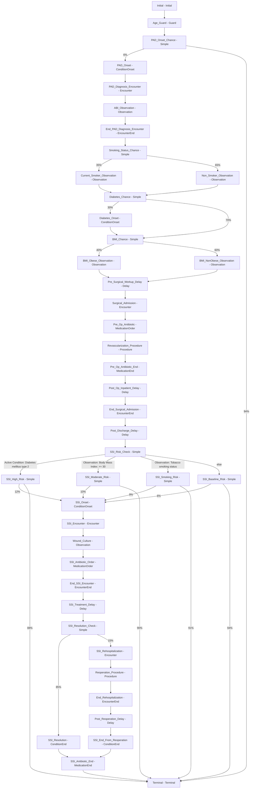

# Synthea Module Diagram

```mermaid
flowchart TD
  n001["Initial - Initial"]
  n002["Age_Guard - Guard"]
  n003["PAD_Onset_Chance - Simple"]
  n004["PAD_Onset - ConditionOnset"]
  n005["PAD_Diagnosis_Encounter - Encounter"]
  n006["ABI_Observation - Observation"]
  n007["End_PAD_Diagnosis_Encounter - EncounterEnd"]
  n008["Smoking_Status_Chance - Simple"]
  n009["Current_Smoker_Observation - Observation"]
  n010["Non_Smoker_Observation - Observation"]
  n011["Diabetes_Chance - Simple"]
  n012["Diabetes_Onset - ConditionOnset"]
  n013["BMI_Chance - Simple"]
  n014["BMI_Obese_Observation - Observation"]
  n015["BMI_NonObese_Observation - Observation"]
  n016["Pre_Surgical_Workup_Delay - Delay"]
  n017["Surgical_Admission - Encounter"]
  n018["Pre_Op_Antibiotic - MedicationOrder"]
  n019["Revascularization_Procedure - Procedure"]
  n020["Pre_Op_Antibiotic_End - MedicationEnd"]
  n021["Post_Op_Inpatient_Delay - Delay"]
  n022["End_Surgical_Admission - EncounterEnd"]
  n023["Post_Discharge_Delay - Delay"]
  n024["SSI_Risk_Check - Simple"]
  n025["SSI_High_Risk - Simple"]
  n026["SSI_Moderate_Risk - Simple"]
  n027["SSI_Smoking_Risk - Simple"]
  n028["SSI_Baseline_Risk - Simple"]
  n029["SSI_Onset - ConditionOnset"]
  n030["SSI_Encounter - Encounter"]
  n031["Wound_Culture - Observation"]
  n032["SSI_Antibiotic_Order - MedicationOrder"]
  n033["End_SSI_Encounter - EncounterEnd"]
  n034["SSI_Treatment_Delay - Delay"]
  n035["SSI_Resolution_Check - Simple"]
  n036["SSI_Resolution - ConditionEnd"]
  n037["SSI_Rehospitalization - Encounter"]
  n038["Reoperation_Procedure - Procedure"]
  n039["End_Rehospitalization - EncounterEnd"]
  n040["Post_Reoperation_Delay - Delay"]
  n041["SSI_End_From_Reoperation - ConditionEnd"]
  n042["SSI_Antibiotic_End - MedicationEnd"]
  n043["Terminal - Terminal"]

  n001 --> n002
  n002 --> n003
  n003 -- 6% --> n004
  n003 -- 94% --> n043
  n004 --> n005
  n005 --> n006
  n006 --> n007
  n007 --> n008
  n008 -- 35% --> n009
  n008 -- 65% --> n010
  n009 --> n011
  n010 --> n011
  n011 -- 30% --> n012
  n011 -- 70% --> n013
  n012 --> n013
  n013 -- 40% --> n014
  n013 -- 60% --> n015
  n014 --> n016
  n015 --> n016
  n016 --> n017
  n017 --> n018
  n018 --> n019
  n019 --> n020
  n020 --> n021
  n021 --> n022
  n022 --> n023
  n023 --> n024
  n024 -- Active Condition: Diabetes mellitus type 2 --> n025
  n024 -- Observation: Body Mass Index: >= 30 --> n026
  n024 -- Observation: Tobacco smoking status --> n027
  n024 -- else --> n028
  n025 -- 12% --> n029
  n025 -- 88% --> n043
  n026 -- 10% --> n029
  n026 -- 90% --> n043
  n027 -- 9% --> n029
  n027 -- 91% --> n043
  n028 -- 6% --> n029
  n028 -- 94% --> n043
  n029 --> n030
  n030 --> n031
  n031 --> n032
  n032 --> n033
  n033 --> n034
  n034 --> n035
  n035 -- 85% --> n036
  n035 -- 15% --> n037
  n036 --> n042
  n037 --> n038
  n038 --> n039
  n039 --> n040
  n040 --> n041
  n041 --> n042
  n042 --> n043
```
