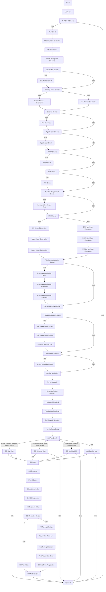

# Synthea Module Diagram

```mermaid
flowchart TD
  n001["Initial"]
  n002["Age Guard"]
  n003["PAD Onset Chance"]
  n004["PAD Onset"]
  n005["PAD Diagnosis Encounter"]
  n006["ABI Observation"]
  n007["End PAD Diagnosis Encounter"]
  n008["Claudication Chance"]
  n009["Claudication Onset"]
  n010["Smoking Status Chance"]
  n011["Current Smoker Observation"]
  n012["Non Smoker Observation"]
  n013["Diabetes Chance"]
  n014["Diabetes Onset"]
  n015["Hypertension Chance"]
  n016["Hypertension Onset"]
  n017["COPD Chance"]
  n018["COPD Onset"]
  n019["CHF Chance"]
  n020["CHF Onset"]
  n021["Functional Impairment Chance"]
  n022["Functional Impairment Onset"]
  n023["BMI Chance"]
  n024["BMI Obese Observation"]
  n025["Height Obese Observation"]
  n026["Weight Obese Observation"]
  n027["BMI NonObese Observation"]
  n028["Height NonObese Observation"]
  n029["Weight NonObese Observation"]
  n030["Prior Revascularization Chance"]
  n031["Prior Revascularization Delay"]
  n032["Prior Revascularization Procedure"]
  n033["Prior Revascularization Recovery"]
  n034["Pre Index Antibiotic Chance"]
  n035["Pre Index Antibiotic Order"]
  n036["Pre Index Antibiotic Delay"]
  n037["Pre Index Antibiotic End"]
  n038["Pre Surgical Workup Delay"]
  n039["Urgent Case Chance"]
  n040["Urgent Case Observation"]
  n041["Surgical Admission"]
  n042["Pre Op Antibiotic"]
  n043["Revascularization Procedure"]
  n044["Pre Op Antibiotic End"]
  n045["Post Op Inpatient Delay"]
  n046["End Surgical Admission"]
  n047["Post Discharge Delay"]
  n048["SSI Risk Check"]
  n049["SSI High Risk"]
  n050["SSI Moderate Risk"]
  n051["SSI Smoking Risk"]
  n052["SSI Baseline Risk"]
  n053["SSI Onset"]
  n054["SSI Encounter"]
  n055["Wound Culture"]
  n056["SSI Antibiotic Order"]
  n057["End SSI Encounter"]
  n058["SSI Treatment Delay"]
  n059["SSI Resolution Check"]
  n060["SSI Resolution"]
  n061["SSI Rehospitalization"]
  n062["Reoperation Procedure"]
  n063["End Rehospitalization"]
  n064["Post Reoperation Delay"]
  n065["SSI End From Reoperation"]
  n066["SSI Antibiotic End"]
  n067["Terminal"]

  n001 --> n002
  n002 --> n003
  n003 -- 20% --> n004
  n003 -- 80% --> n067
  n004 --> n005
  n005 --> n006
  n006 --> n007
  n007 --> n008
  n008 -- 70% --> n009
  n008 -- 30% --> n010
  n009 --> n010
  n010 -- 35% --> n011
  n010 -- 65% --> n012
  n011 --> n013
  n012 --> n013
  n013 -- 30% --> n014
  n013 -- 70% --> n015
  n014 --> n015
  n015 -- 60% --> n016
  n015 -- 40% --> n017
  n016 --> n017
  n017 -- 20% --> n018
  n017 -- 80% --> n019
  n018 --> n019
  n019 -- 15% --> n020
  n019 -- 85% --> n021
  n020 --> n021
  n021 -- 20% --> n022
  n021 -- 80% --> n023
  n022 --> n023
  n023 -- 40% --> n024
  n023 -- 60% --> n027
  n024 --> n025
  n025 --> n026
  n026 --> n030
  n027 --> n028
  n028 --> n029
  n029 --> n030
  n030 -- 25% --> n031
  n030 -- 75% --> n038
  n031 --> n032
  n032 --> n033
  n033 --> n038
  n034 -- 30% --> n035
  n034 -- 70% --> n039
  n035 --> n036
  n036 --> n037
  n037 --> n039
  n038 --> n034
  n039 -- 25% --> n040
  n039 -- 75% --> n041
  n040 --> n041
  n041 --> n042
  n042 --> n043
  n043 --> n044
  n044 --> n045
  n045 --> n046
  n046 --> n047
  n047 --> n048
  n048 -- Active Condition: Diabetes mellitus type 2 --> n049
  n048 -- Observation: Body Mass Index: >= 30 --> n050
  n048 -- Observation: Tobacco smoking status --> n051
  n048 -- else --> n052
  n049 -- 12% --> n053
  n049 -- 88% --> n067
  n050 -- 10% --> n053
  n050 -- 90% --> n067
  n051 -- 9% --> n053
  n051 -- 91% --> n067
  n052 -- 6% --> n053
  n052 -- 94% --> n067
  n053 --> n054
  n054 --> n055
  n055 --> n056
  n056 --> n057
  n057 --> n058
  n058 --> n059
  n059 -- 85% --> n060
  n059 -- 15% --> n061
  n060 --> n066
  n061 --> n062
  n062 --> n063
  n063 --> n064
  n064 --> n065
  n065 --> n066
  n066 --> n067
```
